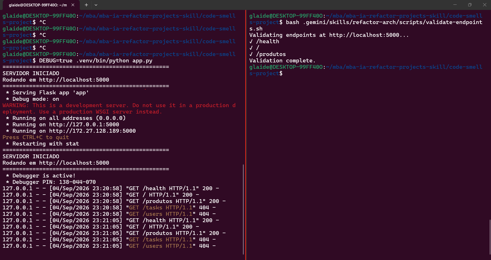
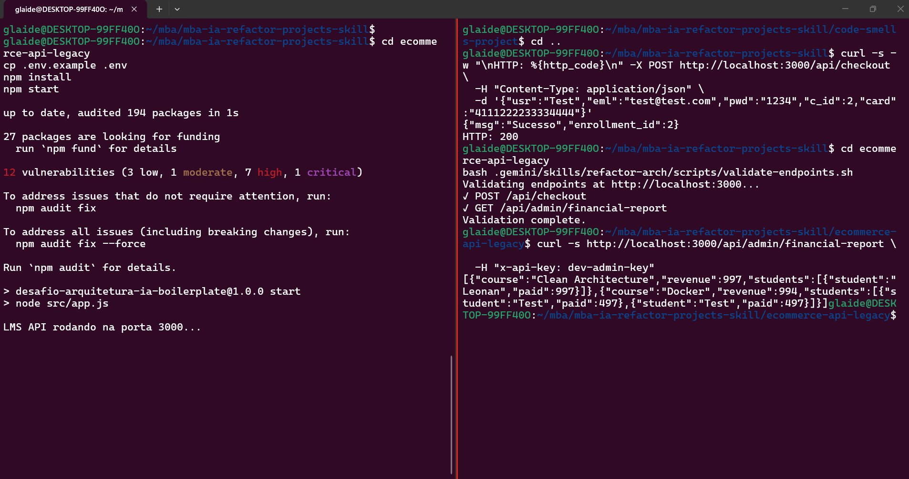
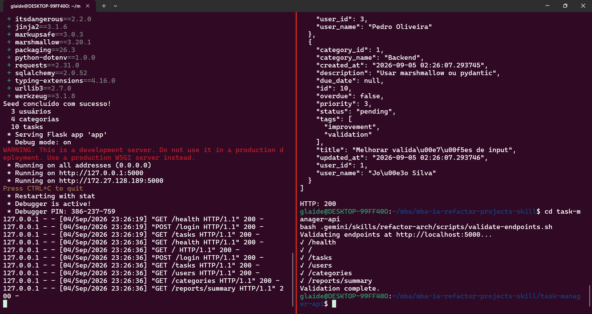

# Criação de Skills — Refatoração Arquitetural Automatizada

Skill `refactor-arch` implementada com **Gemini CLI** (`.gemini/skills/refactor-arch/`). Repositório contém os 3 projetos refatorados, relatórios de auditoria e documentação completa.

---

## A) Análise Manual

A tabela abaixo documenta os problemas de maior impacto identificados manualmente antes de criar a skill (amostra representativa, 8 por projeto). A auditoria automatizada da Fase 2 cobre o código completo e gera relatórios mais abrangentes em [`reports/`](reports/) — ver seção C para os totais consolidados.

### Projeto 1 — code-smells-project (Python/Flask, E-commerce)

| Severidade | Arquivo | Problema | Justificativa |
|------------|---------|----------|---------------|
| CRITICAL | `app.py:59-78` | Endpoint `/admin/query` executa SQL arbitrário sem auth | Comprometimento total do banco de dados |
| CRITICAL | `models.py` (várias linhas) | SQL injection via concatenação de input | Bypass de autenticação e exfiltração de dados |
| HIGH | `app.py:7` | `SECRET_KEY` hardcoded | Chave exposta no endpoint `/health` |
| HIGH | `models.py:83` | Senhas retornadas em `GET /usuarios` | Exposição direta de credenciais |
| MEDIUM | `models.py:171-233` | N+1 queries em listagem de pedidos | Degradação de performance com volume |
| MEDIUM | `database.py:4-10` | Conexão SQLite singleton global | Race conditions em concorrência |
| LOW | `controllers.py` | `except Exception` genérico vaza detalhes | Information disclosure em respostas 500 |
| LOW | `app.py:47-78` | Rotas admin inline fora do padrão de controllers | Manutenção fragmentada; lógica admin bypassa camada de controllers |

### Projeto 2 — ecommerce-api-legacy (Node/Express, LMS)

| Severidade | Arquivo | Problema | Justificativa |
|------------|---------|----------|---------------|
| CRITICAL | `src/utils.js:1-7` | Credenciais hardcoded (gateway, SMTP, DB) | Vazamento via repositório |
| CRITICAL | `src/AppManager.js:80-128` | Relatório financeiro admin sem autenticação | Exposição de PII e receita |
| HIGH | `src/utils.js:17-23` | `badCrypto()` não é hash real | Senhas trivialmente quebráveis |
| HIGH | `src/AppManager.js:40-41` | Checkout ignora senha de usuário existente | Account takeover no checkout |
| MEDIUM | `src/AppManager.js:4-141` | God class (DB + rotas + negócio) | Impossível testar/isolar camadas |
| MEDIUM | `src/AppManager.js:89-127` | Race conditions em callbacks aninhados | Relatórios incompletos/incorretos |
| LOW | `src/AppManager.js:28-33` | Campos crípticos (`usr`, `eml`, `pwd`) | API difícil de integrar |
| LOW | `src/app.js:1-14` | Sem error handler global nem security headers | Erros não tratados; baseline de segurança ausente |

### Projeto 3 — task-manager-api (Python/Flask, Task Manager)

| Severidade | Arquivo | Problema | Justificativa |
|------------|---------|----------|---------------|
| CRITICAL | `routes/*.py` | Nenhum endpoint exige autenticação | CRUD público de todos os recursos |
| CRITICAL | `models/user.py:27-32` | MD5 sem salt para senhas | API deprecated/insegura para credenciais |
| HIGH | `routes/user_routes.py:52-78` | Escalação de privilégio via campo `role` | Qualquer um vira admin |
| HIGH | `services/notification_service.py:9-10` | SMTP credentials hardcoded | Vazamento via VCS |
| MEDIUM | `routes/task_routes.py:14-58` | N+1 queries em listagem | Performance degrada com dados |
| MEDIUM | `services/`, `utils/` | Camadas existem mas não são usadas | Falsa separação arquitetural |
| LOW | `routes/report_routes.py:157-223` | CRUD categorias em report routes | Mistura de responsabilidades |
| LOW | `app.py:30-31` | `db.create_all()` no import do app | Dificulta testes isolados e migrações explícitas |

---

## B) Construção da Skill

### Decisões de design

- **SKILL.md** orquestra 3 fases sequenciais com parada obrigatória entre Fase 2 e 3
- **references/** contém 5 arquivos cobrindo as áreas obrigatórias do enunciado
- **scripts/validate-endpoints.sh** valida boot e endpoints pós-refatoração
- Path Gemini CLI: `.gemini/skills/refactor-arch/` (copiado para os 3 projetos)

### Anti-patterns no catálogo (12)

God Class, SQL Injection, Hardcoded Secrets, Missing Auth, Weak Password Storage, Sensitive Data Exposure, N+1 Queries, Missing Transactions, Blurred Layer Boundaries, Deprecated APIs, Broad Exception Handling, Poor Naming

Incluídos com base nos smells reais encontrados nos 3 projetos legados.

### Agnosticismo de tecnologia

- Heurísticas separadas por indicadores (`requirements.txt` vs `package.json`, `@app.route` vs `app.get`)
- MVC mapeado por responsabilidade, não por nome de pasta existente
- Fase 3 adaptativa: reestruturação total para monolitos flat; consolidação de camadas para projetos parcialmente organizados

### Desafios e soluções

- **Gemini CLI vs Claude Code:** path adaptado para `.gemini/skills/`; invocação via prompt explícito com `refactor-arch`
- **Projeto 3 over-refactor:** instrução no playbook para preservar blueprints e melhorar camadas existentes
- **sqlite3 promisify (Node):** wrapper customizado para capturar `lastID` do callback

---

## C) Resultados

### Findings por severidade

| Projeto | CRITICAL | HIGH | MEDIUM | LOW | Total |
|---------|----------|------|--------|-----|-------|
| code-smells-project | 4 | 4 | 3 | 2 | 13 |
| ecommerce-api-legacy | 3 | 4 | 3 | 2 | 12 |
| task-manager-api | 4 | 3 | 4 | 2 | 13 |

Relatórios completos em [`reports/`](reports/).

> **Nota A ↔ C:** a seção A lista 8 findings por projeto (amostra manual focada nos smells mais impactantes). A Fase 2 da skill varre todos os arquivos fonte e encontra findings adicionais — por exemplo, endpoints admin não listados na análise inicial (`/admin/reset-db`, plaintext passwords) ou violações transversais (God Class, APIs deprecated). Os totais abaixo refletem a auditoria completa, não apenas a amostra manual.

### Observações cross-stack

**Projeto 1 — monolito flat (Python/Flask):** exigiu reestruturação total. A Fase 3 criou `src/` do zero, extraiu models/controllers por domínio e centralizou rotas em `views/routes.py`. Foi o caso com maior volume de transformação estrutural.

**Projeto 2 — Node/Express com God Class:** a skill dividiu `AppManager.js` em models, controllers, routes e services. O desafio principal foi o padrão callback do `sqlite3` — o playbook inclui wrapper promisified para capturar `lastID`. Auth administrativa via API key substituiu endpoints abertos.

**Projeto 3 — Flask parcialmente organizado:** a Fase 3 preservou blueprints e pastas existentes, extraindo controllers e tornando routes finas. A skill reconheceu camadas já presentes (`models/`, `services/`) e focou em wiring (NotificationService), auth com Bearer token e RBAC, em vez de recriar a estrutura.

**Padrão comum nos 3:** Fase 1 detectou stack corretamente em todos; Fase 2 pausou para confirmação; Fase 3 validou boot + endpoints. Projetos Python compartilharam padrões (`werkzeug` hashing, error handler Flask); Node exigiu adaptação para middleware Express e variáveis de ambiente.

### Estrutura antes/depois

**Projeto 1 — antes:** 4 arquivos flat (`app.py`, `controllers.py`, `models.py`, `database.py`)

**Projeto 1 — depois:**
```
code-smells-project/
├── app.py
└── src/
    ├── config/settings.py
    ├── database.py
    ├── models/ (produto, usuario, pedido)
    ├── controllers/ (produto, usuario, pedido, health)
    ├── views/routes.py
    └── middlewares/error_handler.py
```

**Projeto 2 — antes:** `app.js` + `AppManager.js` (god class) + `utils.js`

**Projeto 2 — depois:**
```
ecommerce-api-legacy/src/
├── config/index.js
├── database.js
├── models/ (user, course, enrollment)
├── controllers/checkoutController.js
├── routes/apiRoutes.js
├── middlewares/errorHandler.js
└── app.js
```

**Projeto 3 — antes:** blueprints com lógica nas routes; services/utils não usados

**Projeto 3 — depois:**
```
task-manager-api/
├── config/settings.py
├── controllers/ (task, user, report)
├── routes/ (thin wrappers → controllers)
├── models/, services/, middlewares/
└── app.py
```

### Checklist de Validação

#### Projeto 1 — code-smells-project

**Fase 1 — Análise**
- [x] Linguagem detectada corretamente (Python)
- [x] Framework detectado corretamente (Flask 3.1.1)
- [x] Domínio descrito corretamente (E-commerce API)
- [x] Arquivos analisados condizem (4 → 12 após refactor)

**Fase 2 — Auditoria**
- [x] Relatório segue template
- [x] Findings com arquivo e linhas exatos
- [x] Ordenados CRITICAL → LOW
- [x] ≥5 findings (13 total)
- [x] APIs deprecated incluídas (debug=True, plaintext passwords)
- [x] Pausa antes da Fase 3

**Fase 3 — Refatoração**
- [x] Estrutura MVC
- [x] Config extraída para módulo
- [x] Models, Views/Routes, Controllers separados
- [x] Error handling centralizado
- [x] Entry point claro (`app.py`)
- [x] Aplicação inicia sem erros
- [x] Endpoints respondem (`/health` 200, `/produtos` 200, `/login` 200)

#### Projeto 2 — ecommerce-api-legacy

**Fase 1 — Análise**
- [x] Node.js + Express detectados
- [x] Domínio LMS/checkout identificado
- [x] 3 arquivos fonte analisados

**Fase 2 — Auditoria**
- [x] 12 findings, incluindo 3 CRITICAL
- [x] Pausa antes da Fase 3

**Fase 3 — Refatoração**
- [x] MVC aplicado
- [x] Checkout retorna 200 com cartão Visa
- [x] Financial report responde
- [x] Delete user responde

#### Projeto 3 — task-manager-api

**Fase 1 — Análise**
- [x] Python/Flask + SQLAlchemy detectados
- [x] Domínio Task Manager identificado
- [x] Camadas parciais reconhecidas

**Fase 2 — Auditoria**
- [x] 13 findings em projeto parcialmente organizado
- [x] Pausa antes da Fase 3

**Fase 3 — Refatoração**
- [x] Controllers extraídos; routes finas
- [x] NotificationService wired
- [x] `/health`, `/tasks`, `/users`, `/login` respondem

### Logs de validação

```
# Projeto 1
health 200 {'status': 'ok', 'database': 'connected', ...}
produtos 200 (10 items)
login 200 True

# Projeto 2
POST /api/checkout → {"msg":"Sucesso","enrollment_id":2} HTTP:200

# Projeto 3
health 200 | tasks 200 | users 200 | login 200
```

### Screenshots de validação

**Projeto 1 — code-smells-project**



**Projeto 2 — ecommerce-api-legacy**



**Projeto 3 — task-manager-api**



---

## D) Como Executar

### Pré-requisitos

- [Gemini CLI](https://geminicli.com/) instalado e autenticado
- Python 3.10+ (recomendado: `uv` para venv)
- Node.js 18+

### Invocar a skill

```bash
# Projeto 1
cd code-smells-project
gemini "Execute a skill refactor-arch neste projeto"

# Projeto 2
cd ../ecommerce-api-legacy
gemini "Execute a skill refactor-arch neste projeto"

# Projeto 3
cd ../task-manager-api
gemini "Execute a skill refactor-arch neste projeto"
```

Verificar descoberta da skill: `gemini skills list`

### Validar refatoração

Com o servidor rodando em outro terminal, use o script de validação incluído na skill:

```bash
# Projeto 1 (porta 5000)
cd code-smells-project
bash .gemini/skills/refactor-arch/scripts/validate-endpoints.sh

# Projeto 2 (porta 3000)
cd ecommerce-api-legacy
bash .gemini/skills/refactor-arch/scripts/validate-endpoints.sh

# Projeto 3 (porta 5000)
cd task-manager-api
bash .gemini/skills/refactor-arch/scripts/validate-endpoints.sh
```

#### Validar manualmente (com autenticação)

```bash
# Projeto 1 — endpoints públicos + login
cd code-smells-project
uv venv .venv && uv pip install -r requirements.txt
.venv/bin/python app.py

curl http://localhost:5000/health
curl http://localhost:5000/produtos
TOKEN=$(curl -s -X POST http://localhost:5000/login \
  -H "Content-Type: application/json" \
  -d '{"email":"admin@loja.com","senha":"admin123"}' | python3 -c "import sys,json; print(json.load(sys.stdin)['token'])")
curl -H "Authorization: Bearer $TOKEN" http://localhost:5000/pedidos/usuario/2

# Projeto 2 — checkout público; admin exige API key
cd ecommerce-api-legacy
cp .env.example .env
npm install && npm start

curl -X POST http://localhost:3000/api/checkout \
  -H "Content-Type: application/json" \
  -d '{"usr":"Test","eml":"test@test.com","pwd":"1234","c_id":2,"card":"4111222233334444"}'
curl http://localhost:3000/api/admin/financial-report \
  -H "x-api-key: dev-admin-key"

# Projeto 3 — seed obrigatório no primeiro boot; demais rotas exigem token
cd task-manager-api
uv venv .venv && uv pip install -r requirements.txt
.venv/bin/python seed.py
.venv/bin/python app.py

curl http://localhost:5000/health
TOKEN=$(curl -s -X POST http://localhost:5000/login \
  -H "Content-Type: application/json" \
  -d '{"email":"joao@email.com","password":"admin1234"}' | python3 -c "import sys,json; print(json.load(sys.stdin)['token'])")
curl -H "Authorization: Bearer $TOKEN" http://localhost:5000/tasks
```

---

## Enunciado do Desafio

Ao longo do curso você aprendeu o que são Skills e como elas permitem que um agente de IA atue como um especialista em tarefas específicas. Agora imagine o seguinte cenário: você herdou 3 projetos legados com problemas de arquitetura, segurança e qualidade de código. Revisar e corrigir tudo manualmente levaria dias.

Neste desafio, você vai criar uma Skill que automatiza esse processo — analisando, auditando e refatorando qualquer projeto para o padrão MVC, independente da tecnologia.

## Objetivo

Você deve entregar uma Skill capaz de:

- Analisar uma codebase detectando linguagem, framework e arquitetura atual
- Identificar anti-patterns e code smells, classificando por severidade com arquivo e linha exatos
- Gerar um relatório de auditoria estruturado com todos os achados
- Refatorar o projeto para o padrão MVC (Model-View-Controller), eliminando os problemas encontrados
- Validar o resultado garantindo que a aplicação continua funcionando após as mudanças

A skill deve ser agnóstica de tecnologia, funcionando com diferentes linguagens e frameworks.

## Contexto


### Definição de Severidades

Para padronizar a sua auditoria e os relatórios gerados pela IA, utilize a seguinte escala de classificação baseada em problemas de MVC e SOLID:

- **CRITICAL:** Falhas graves de arquitetura ou segurança que impedem o funcionamento correto, expõem dados sensíveis (ex: credenciais hardcoded, SQL Injection) ou violam completamente a separação de responsabilidades (ex: "God Class" contendo banco de dados, lógicas complexas e roteamento no mesmo arquivo).
- **HIGH:** Fortes violações do padrão MVC ou princípios SOLID que dificultam muito a manutenção e testes (ex: lógicas de negócio pesadas presas dentro de Controllers, forte acoplamento sem Injeção de Dependência, ou uso de estado global mutável em toda a aplicação).
- **MEDIUM:** Problemas de padronização, duplicação de código ou gargalos de performance moderada (ex: Queries N+1 no banco de dados, uso inadequado de middlewares, validações ausentes nas rotas).
- **LOW:** Melhorias de legibilidade, nomenclatura de variáveis ruins, ou "magic numbers" soltos pelo código.


### Exemplo de Uso no CLI

```bash
# Executar a skill no projeto com problemas
cd code-smells-project
claude "/refactor-arch"
```

```
================================
PHASE 1: PROJECT ANALYSIS
================================
Language:      Python
Framework:      Flask 3.1.1
Dependencies:  flask-cors
Domain:        E-commerce API (produtos, pedidos, usuários)
Architecture:  Monolítica — tudo em 4 arquivos, sem separação de camadas
Source files:  4 files analyzed
DB tables:     produtos, usuarios, pedidos, itens_pedido
================================
```

```
================================
ARCHITECTURE AUDIT REPORT
================================
Project: code-smells-project
Stack:   Python + Flask
Files:   4 analyzed | ~800 lines of code

## Summary
CRITICAL: 4 | HIGH: 5 | MEDIUM: 2 | LOW: 3

## Findings

### [CRITICAL] God Class / God Method
File: models.py:1-350
Description: Arquivo único contém toda lógica de negócio, queries SQL, validação e formatação para 4 domínios diferentes.
Impact: Impossível testar em isolamento, qualquer mudança afeta tudo.
Recommendation: Separar em models e controllers por domínio.

### [CRITICAL] Hardcoded Credentials
File: app.py:8
Description: SECRET_KEY hardcoded como 'minha-chave-super-secreta-123'
...

================================
Total: 14 findings
================================

Phase 2 complete. Proceed with refactoring (Phase 3)? [y/n]
> y
```

```
[... refatoração executada ...]

================================
PHASE 3: REFACTORING COMPLETE
================================
## New Project Structure
src/
├── config/settings.py
├── models/
│   ├── produto_model.py
│   └── usuario_model.py
├── views/
│   └── routes.py
├── controllers/
│   ├── produto_controller.py
│   └── pedido_controller.py
├── middlewares/error_handler.py
└── app.py (composition root)

## Validation
  ✓ Application boots without errors
  ✓ All endpoints respond correctly
  ✓ Zero anti-patterns remaining
================================
```


## Tecnologias obrigatórias

- **Ferramenta:** uma das três opções abaixo (não são aceitas outras ferramentas):
  - Claude Code
  - Gemini CLI
  - OpenAI Codex
- **Recurso:** Custom Skills (ou o equivalente na ferramenta escolhida)
- **Formato dos arquivos de referência:** Markdown
- **Projetos-alvo:** Python/Flask (2 projetos) e Node.js/Express (1 projeto) (fornecidos no repositório base)

> **Nota sobre a ferramenta:** Os exemplos deste documento usam o Claude Code (`.claude/skills/`) como referência, pois é a ferramenta utilizada no curso. Se você optar por Gemini CLI ou Codex, adapte o nome da pasta e o comando de invocação conforme a convenção dela — o conceito de skill e a estrutura interna (SKILL.md + arquivos de referência) permanecem os mesmos.


## Requisitos


### 1. Análise Manual dos Projetos

Antes de criar a skill, você deve entender os problemas que ela vai resolver.

**Tarefas:**

- Analisar o projeto `code-smells-project/` (Python/Flask — API de E-commerce)
- Analisar o projeto `ecommerce-api-legacy/` (Node.js/Express — LMS API com fluxo de checkout)
- Analisar o projeto `task-manager-api/` (Python/Flask — API de Task Manager)

Para cada projeto, identificar e documentar no mínimo 5 problemas, incluindo pelo menos:

- 1 de severidade CRITICAL ou HIGH
- 2 de severidade MEDIUM
- 2 de severidade LOW

Documentar os achados na seção "Análise Manual" do seu `README.md`

> **Dica:** Não precisa encontrar todos os problemas — foque nos que têm maior impacto arquitetural. Use os projetos como insumo para entender quais padrões sua skill precisa detectar.

> **Por que 3 projetos?** Dois são Python/Flask (com níveis de organização diferentes) e um é Node.js/Express. Sua skill precisa funcionar nos 3 para provar que é verdadeiramente agnóstica de tecnologia — lidando tanto com código completamente desestruturado quanto com projetos que já possuem alguma separação de camadas.


### 2. Criação da Skill

Agora que você conhece os problemas, crie uma skill que os detecte, gere um relatório de auditoria e corrija automaticamente.

**Tarefas:**

Criar a skill dentro do projeto `code-smells-project/` e implementar o SKILL.md com 3 fases sequenciais:

- **Fase 1 — Análise:** Detectar stack, mapear arquitetura atual, imprimir resumo
- **Fase 2 — Auditoria:** Cruzar código contra catálogo de anti-patterns, gerar relatório, pedir confirmação
- **Fase 3 — Refatoração:** Reestruturar para o padrão MVC, validar que funciona

Criar arquivos de referência em Markdown que forneçam à skill o conhecimento necessário para executar as 3 fases. Os arquivos devem cobrir **obrigatoriamente** as seguintes áreas de conhecimento:


| Área de conhecimento      | O que deve conter                                                                                     |
| ------------------------- | ----------------------------------------------------------------------------------------------------- |
| Análise de projeto        | Heurísticas para detecção de linguagem, framework, banco de dados e mapeamento de arquitetura         |
| Catálogo de anti-patterns | Anti-patterns com sinais de detecção e classificação de severidade                                    |
| Template de relatório     | Formato padronizado do relatório de auditoria (Fase 2)                                                |
| Guidelines de arquitetura | Regras do padrão MVC alvo (camadas Models, Views/Routes e Controllers, responsabilidades de cada uma) |
| Playbook de refatoração   | Padrões concretos de transformação para cada anti-pattern (com exemplos de código)                    |


> **Nota:** Você tem liberdade para organizar os arquivos de referência como preferir — pode usar os nomes e a quantidade de arquivos que fizer sentido para sua skill. O importante é que todas as 5 áreas de conhecimento estejam cobertas. O nome da skill (`refactor-arch`) e o arquivo `SKILL.md` são obrigatórios e não devem ser alterados. O path da skill segue a convenção da ferramenta escolhida (no Claude Code, por exemplo, é `.claude/skills/refactor-arch/`).

**Requisitos da skill:**

- Deve ser agnóstica de tecnologia — deve funcionar corretamente nos 3 projetos fornecidos, independente da stack ou nível de organização
- O catálogo de anti-patterns deve conter no mínimo 8 anti-patterns com severidade distribuída (CRITICAL, HIGH, MEDIUM, LOW)
- O catálogo deve incluir detecção de APIs deprecated — identificar uso de APIs obsoletas e recomendar o equivalente moderno
- O playbook deve ter no mínimo 8 padrões de transformação com exemplos de código antes/depois
- A Fase 2 deve pausar e pedir confirmação antes de modificar qualquer arquivo
- A Fase 3 deve validar o resultado (boot da aplicação + endpoints funcionando)


### 3. Execução da Skill

Execute sua skill nos 3 projetos e valide que ela funciona em todas as stacks.

#### Projeto 1 — code-smells-project (Python/Flask)

Invocar a skill no Claude Code:

```bash
claude "/refactor-arch"
```

> **Nota:** O comando acima é o exemplo com Claude Code. Se você estiver usando Gemini CLI ou Codex, utilize o comando equivalente para invocar uma skill na sua ferramenta.

- Verificar que a Fase 1 detecta corretamente a stack e imprime o resumo
- Verificar que a Fase 2 encontra no mínimo 5 dos problemas documentados na sua análise manual
- Confirmar a execução da Fase 3
- Verificar que a Fase 3:
  - Cria a estrutura de diretórios baseada em MVC
  - A aplicação inicia sem erros
  - Os endpoints originais continuam respondendo
- Salvar o relatório de auditoria (output da Fase 2) em `reports/audit-project-1.md`
- Commitar o código refatorado do projeto no repositório


#### Projeto 2 — ecommerce-api-legacy (Node.js/Express)

Prove que sua skill é reutilizável em outro projeto de backend, mas com stack diferente.

- Copiar a pasta `.claude/skills/refactor-arch/` para dentro de `ecommerce-api-legacy/`
- Invocar a skill:

```bash
cd ../ecommerce-api-legacy
claude "/refactor-arch"
```

- Verificar que as 3 fases executam corretamente neste projeto
- Salvar o relatório em `reports/audit-project-2.md`
- Commitar o código refatorado do projeto no repositório


#### Projeto 3 — task-manager-api (Python/Flask)

Agora o teste com um projeto Python/Flask que já possui alguma organização de camadas (models, routes, services, utils).

- Copiar a pasta `.claude/skills/refactor-arch/` para dentro de `task-manager-api/`
- Invocar a skill:

```bash
cd ../task-manager-api
claude "/refactor-arch"
```

- Verificar que:
  - A Fase 1 detecta corretamente Python/Flask como stack e identifica o domínio de Task Manager
  - A Fase 2 identifica problemas mesmo em um projeto parcialmente organizado
  - A Fase 3 melhora a estrutura sem quebrar a aplicação (todos os endpoints devem continuar respondendo)
- Salvar o relatório em `reports/audit-project-3.md`
- Commitar o código refatorado do projeto no repositório

> **Nota:** Este projeto já possui alguma separação de camadas, mas isso não significa que a arquitetura está adequada. A skill deve identificar tanto problemas de código (segurança, performance, qualidade) quanto oportunidades de melhoria arquitetural. Se houver mudanças estruturais necessárias, a skill deve propô-las e executá-las.


#### Validação

Para cada projeto refatorado, valide o seguinte checklist:

```markdown
## Checklist de Validação

### Fase 1 — Análise
- [ ] Linguagem detectada corretamente
- [ ] Framework detectado corretamente
- [ ] Domínio da aplicação descrito corretamente
- [ ] Número de arquivos analisados condiz com a realidade

### Fase 2 — Auditoria
- [ ] Relatório segue o template definido nos arquivos de referência
- [ ] Cada finding tem arquivo e linhas exatos
- [ ] Findings ordenados por severidade (CRITICAL → LOW)
- [ ] Mínimo de 5 findings identificados
- [ ] Detecção de APIs deprecated incluída (se aplicável)
- [ ] Skill pausa e pede confirmação antes da Fase 3

### Fase 3 — Refatoração
- [ ] Estrutura de diretórios segue padrão MVC
- [ ] Configuração extraída para módulo de config (sem hardcoded)
- [ ] Models criados para abstrair dados
- [ ] Views/Routes separadas para visualização ou roteamento
- [ ] Controllers concentram o fluxo da aplicação
- [ ] Error handling centralizado
- [ ] Entry point claro
- [ ] Aplicação inicia sem erros
- [ ] Endpoints originais respondem corretamente
```

> **Dica:** Se a skill não detectou problemas suficientes ou a refatoração falhou, ajuste os arquivos de referência e execute novamente. É normal precisar de 2-4 iterações.


## Entregável

Repositório público no GitHub (fork do repositório base) contendo:

- Skill completa em `.claude/skills/refactor-arch/` (dentro dos 3 projetos)
- Código refatorado dos 3 projetos (resultado da execução da Fase 3, commitado no repositório)
- Relatórios de auditoria em `reports/` (3 arquivos)
- `README.md` atualizado


### Estrutura do repositório

Faça um fork do repositório base contendo os três projetos com code smells.

> **Nota:** A estrutura abaixo usa Claude Code como exemplo (`.claude/skills/`). Se estiver usando outra ferramenta, adapte os caminhos conforme a convenção dela.

```
desafio-skills/
├── README.md                              # Sua documentação
│
├── code-smells-project/                   # Projeto 1 — Python/Flask (API de E-commerce)
│   ├── .claude/
│   │   └── skills/
│   │       └── refactor-arch/             # ← SUA SKILL AQUI
│   │           ├── SKILL.md
│   │           └── (arquivos de referência)
│   ├── app.py
│   ├── controllers.py
│   ├── models.py
│   ├── database.py
│   └── requirements.txt
│
├── ecommerce-api-legacy/                  # Projeto 2 — Node.js/Express (LMS API com checkout)
│   ├── .claude/
│   │   └── skills/
│   │       └── refactor-arch/             # ← CÓPIA DA SKILL
│   │           └── ...
│   ├── src/
│   │   ├── app.js
│   │   ├── AppManager.js
│   │   └── utils.js
│   ├── api.http
│   └── package.json
│
├── task-manager-api/                      # Projeto 3 — Python/Flask (API de Task Manager)
│   ├── .claude/
│   │   └── skills/
│   │       └── refactor-arch/             # ← CÓPIA DA SKILL
│   │           └── ...
│   ├── app.py
│   ├── database.py
│   ├── seed.py
│   ├── requirements.txt
│   ├── models/
│   ├── routes/
│   ├── services/
│   └── utils/
│
└── reports/                               # Relatórios gerados
    ├── audit-project-1.md                 # Saída da Fase 2 no projeto 1
    ├── audit-project-2.md                 # Saída da Fase 2 no projeto 2
    └── audit-project-3.md                 # Saída da Fase 2 no projeto 3
```

**O que você vai criar:**

- `.claude/skills/refactor-arch/` — A skill completa (SKILL.md + arquivos de referência)
- Código refatorado dos 3 projetos — resultado da execução da Fase 3, commitado no repositório
- `reports/audit-project-{1,2,3}.md` — Relatório de auditoria de cada projeto
- `README.md` — Documentação do seu processo

**O que já vem pronto:**

- `code-smells-project/` — API de E-commerce Python/Flask com code smells intencionais
- `ecommerce-api-legacy/` — LMS API Node.js/Express (com fluxo de checkout) e problemas de implementação
- `task-manager-api/` — API de Task Manager Python/Flask com organização parcial e problemas de segurança/qualidade

> **Dica:** Cada projeto contém problemas intencionais de diferentes severidades (CRITICAL, HIGH, MEDIUM, LOW), incluindo falhas de segurança, violações arquiteturais e problemas de qualidade de código. Parte do desafio é identificá-los por conta própria através da análise manual do código.


### README.md deve conter

**A) Seção "Análise Manual":**

- Lista dos problemas identificados manualmente em cada projeto
- Classificação por severidade
- Justificativa de por que cada problema é relevante

**B) Seção "Construção da Skill":**

- Decisões de design: como estruturou o SKILL.md e os arquivos de referência
- Quais anti-patterns incluiu no catálogo e por quê
- Como garantiu que a skill é agnóstica de tecnologia
- Desafios encontrados e como resolveu

**C) Seção "Resultados":**

- Resumo dos relatórios de auditoria dos 3 projetos (quantos findings por severidade em cada)
- Comparação antes/depois da estrutura de cada projeto
- Checklist de validação preenchido para cada projeto
- Screenshots ou logs mostrando as aplicações rodando após refatoração
- Observações sobre como a skill se comportou em stacks diferentes

**D) Seção "Como Executar":**

- Pré-requisitos (a ferramenta escolhida — Claude Code, Gemini CLI ou Codex — instalada e configurada)
- Comandos para executar a skill em cada projeto
- Como validar que a refatoração funcionou


### Ordem de execução sugerida

**1. Analisar os projetos manualmente**

Leia o código dos três projetos e documente os problemas encontrados.

**2. Criar a skill**

Escreva o SKILL.md e os arquivos de referência.

**3. Executar nos 3 projetos**

```bash
# Projeto 1
cd code-smells-project
claude "/refactor-arch"

# Projeto 2
cd ../ecommerce-api-legacy
claude "/refactor-arch"

# Projeto 3
cd ../task-manager-api
claude "/refactor-arch"
```

Salve a saída da Fase 2 de cada projeto em `reports/audit-project-{1,2,3}.md`.

**4. Iterar**

Se a skill não detectou problemas suficientes ou a refatoração falhou, ajuste os arquivos de referência e execute novamente. É normal precisar de 2-4 iterações.

## Critérios de Aceite

A skill deve atingir os seguintes mínimos em **todos os 3 projetos**:


| Critério                                    | Requisito                  |
| ------------------------------------------- | -------------------------- |
| Fase 1 detecta stack corretamente           | OBRIGATÓRIO (3/3 projetos) |
| Fase 2 encontra >= 5 findings               | OBRIGATÓRIO (3/3 projetos) |
| Fase 2 inclui pelo menos 1 CRITICAL ou HIGH | OBRIGATÓRIO (3/3 projetos) |
| Fase 3 aplicação funciona após refatoração  | OBRIGATÓRIO (3/3 projetos) |


**IMPORTANTE:** Todos os critérios devem ser atingidos nos 3 projetos, não apenas em um!

> **Sobre o projeto 3 (task-manager-api):** Este projeto já possui alguma organização. "aplicação funciona" significa que a API inicia sem erros e todos os endpoints continuam respondendo corretamente.


## Referências

- [Claude Code: Skills](https://docs.anthropic.com/en/docs/claude-code/skills) — Documentação oficial sobre como criar e estruturar Skills
- [Claude Code: Overview](https://docs.anthropic.com/en/docs/claude-code/overview) — Visão geral do Claude Code e suas capacidades
- [The Complete Guide to Building Skills for Claude (PDF)](https://resources.anthropic.com/hubfs/The-Complete-Guide-to-Building-Skill-for-Claude.pdf) — Guia completo da Anthropic sobre construção de Skills
- [Equipping Agents for the Real World with Agent Skills](https://claude.com/blog/equipping-agents-for-the-real-world-with-agent-skills) — Blog oficial da Anthropic sobre Agent Skills

---


## Dicas Finais

- **Comece pela análise manual** — entender os problemas profundamente é essencial para criar uma skill que os detecte.
- **O SKILL.md é um prompt** — ele instrui o agente sobre o que fazer, enquanto os arquivos de referência fornecem o conhecimento de domínio.
- **Seja específico nos sinais de detecção** — "código ruim" não ajuda; "query SQL dentro de loop for" é acionável.
- **Teste incrementalmente** — não tente criar a skill perfeita de primeira.
- **A skill deve ser copiável** — se ela só funciona em um projeto específico, está acoplada demais. Teste nos 3 projetos para validar.
- **Projetos diferentes exigem adaptação** — a Fase 3 de um projeto já parcialmente organizado não vai ter as mesmas transformações de um monolito. Sua skill deve se adaptar ao contexto.
- **Pedir confirmação na Fase 2 é obrigatório** — o humano deve revisar o relatório antes de qualquer modificação.
- **Consulte as referências do curso** — revise a documentação oficial da ferramenta escolhida e os materiais das aulas para relembrar a estrutura e anatomia de uma skill.

